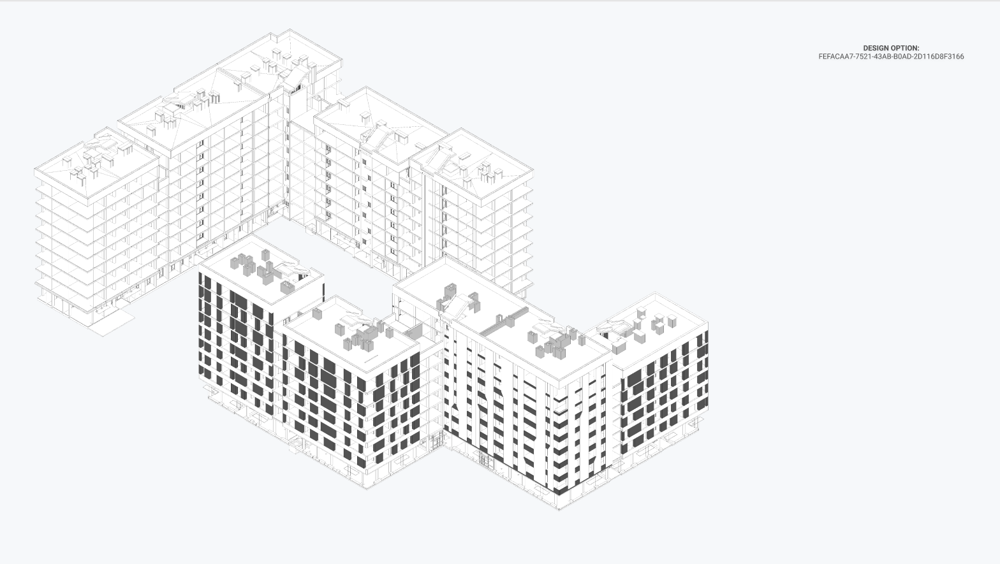

# Facade Toolkit

Work in progress prototype. Set of grasshopper definitions that allow to generate facade patterns, based on prescripted rules, and create native 3D elements in BIM software selected for each particular project.

## Methodology

Text placeholder

1. [Limits Definition](###Limits-Definition)
2. [Object Inheritance Scheme](###Object-Inheritance-Scheme)
3. [Design Evaluation](###Design-Evaluation)
4. [Model generation](###Model-generation)

### Limits Definition

Limits that put a demand on a facade based on simple primitives (on early dev stage) and Architectural Model IfcEntities:

| Model element         | Element role                   |
|-----------------------|--------------------------------|
| Breps                 | Massing models allow to define facade surface   |
| IfcSpaces             | Rooms that define extra properties for facade panel   |
| IfcColumns            | Structural elements as limits  |
| IfcWalls              | Walls as limits                |
| IfcFurnishingElement  | Furnishing element (kitchen cabinets, storage, ect) as limits |

### Object Inheritance Scheme

### Design Evaluation

### Model generation

## List of the plug-ins we use in the definitions

- [Human](https://www.food4rhino.com/app/human)
- [HumanUI](https://www.food4rhino.com/app/human-ui)
- [Metahopper](https://www.food4rhino.com/app/metahopper)
- [Telepathy](https://www.food4rhino.com/app/telepathy)
- [Speckle](https://github.com/speckleworks/SpeckleRhino)
- [Slingshot](https://provingground.io/tools/slingshot/)
- [GeometryGymIFC](https://geometrygym.wordpress.com/downloads-windows/)
- [Archicad-Grasshopper Connector](https://www.graphisoft.com/downloads/addons/interoperability/rhino.html#live-connection-plugin)

## To Do

