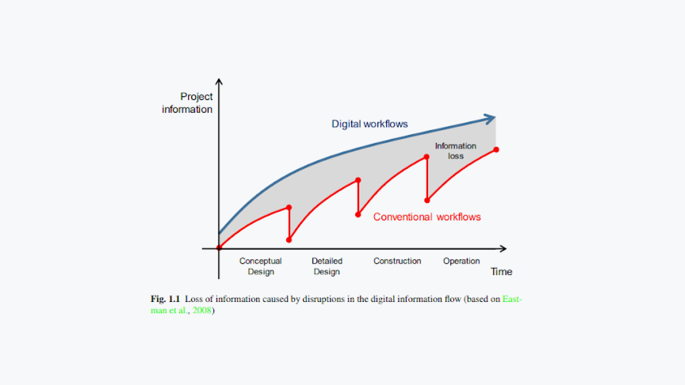
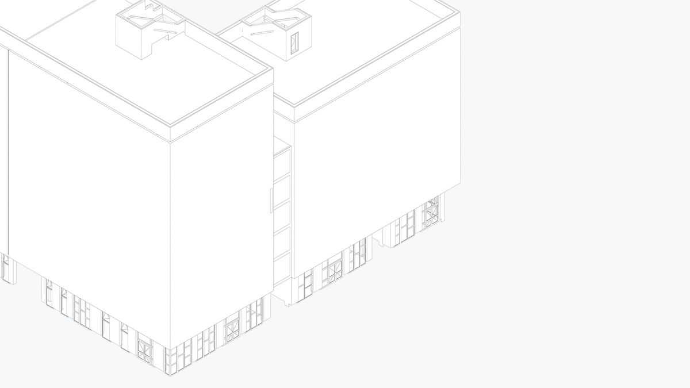
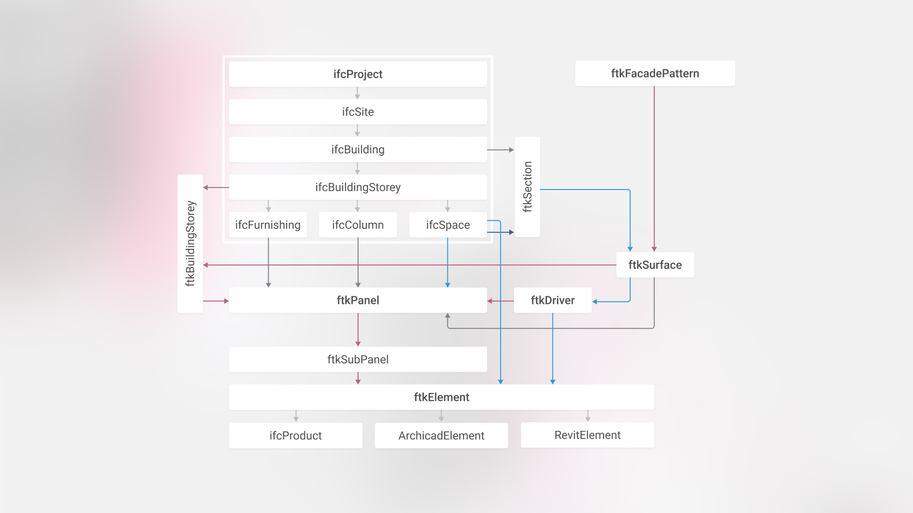
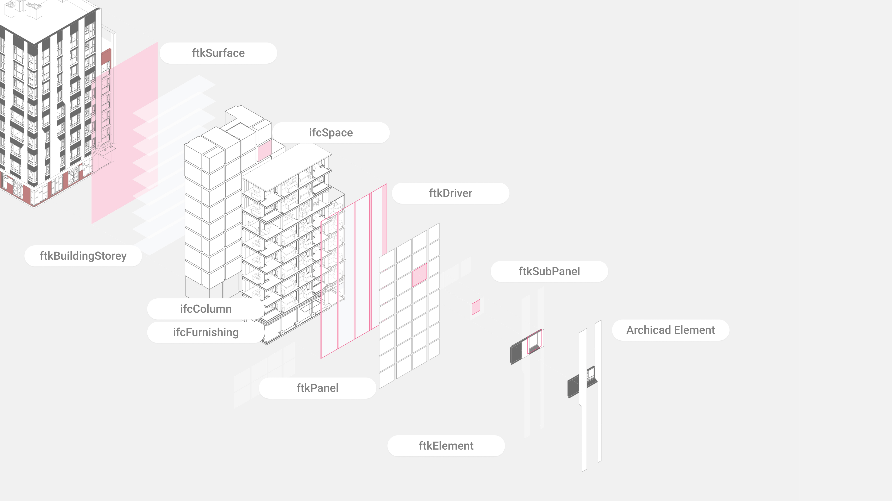
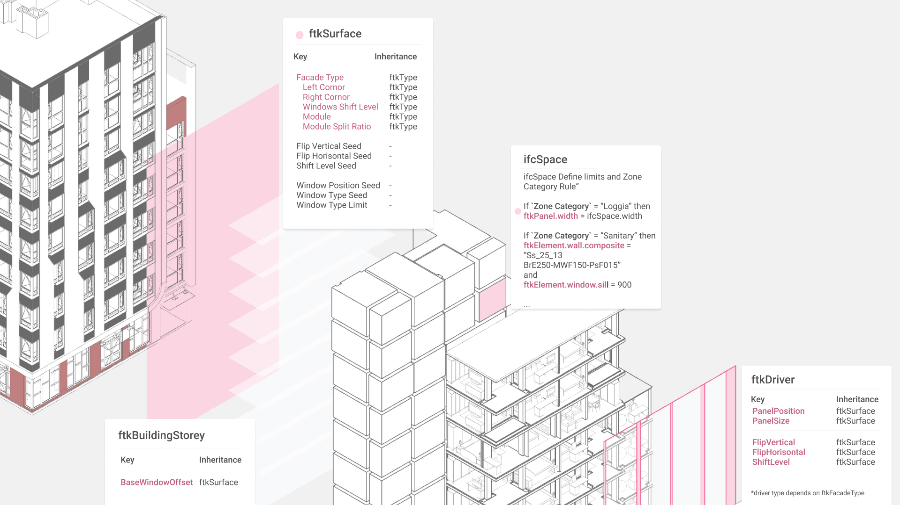
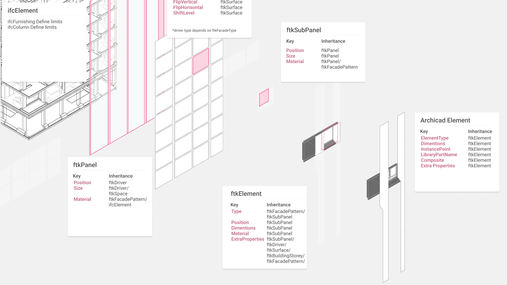
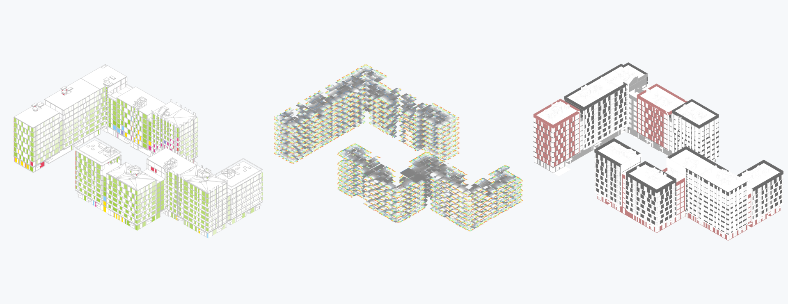

# Facade Toolkit

Work in progress prototype. Set of grasshopper definitions that allow to generate facade patterns, based on prescripted rules. Interoperability workflow for model data exchange.

## Methodology

Developed by [Spatial Tech](https://github.com/sptch) methodology was adopted to Archimatika`s design process. Set of tools was developed to fit Archimatika technology stack. We use openBIM and interoperability principles to deploy integrated algorithmic workflow.

Common weak in AEC industry is disintegrated old fashioned project life circle. Even using BIM tools and techniques Archimatika still loss data and start each design stage almost from scratch.

In an experiment, we have been trying to implement an automated workflow across different design stages and teams. We automate project processes by integrating algorithms at the early design stage and using feedback mechanisms based on models data exchange.

<!---

#### FTK Toolkit features:

1. [Limits Definition](###Limits-Definition)
2. [Object Inheritance Schema](###Object-Inheritance-Schema)
3. [Design Evaluation](###Design-Evaluation)
4. [Model generation](###Model-generation)

--->

### Limits Definition

Limits that put a demand on a facade based on simple primitives (on early dev stage) and Architectural Model IfcEntities:

| Model element         | Element role                   |
|-----------------------|--------------------------------|
| Breps                 | Massing models allow to define facade surface   |
| IfcSpaces             | Rooms  define extra properties for facade panel   |
| IfcColumns            | Structural elements as limits  |
| IfcWalls              | Walls as limits                |
| IfcFurnishingElement  | Furnishing element (kitchen cabinets, storage, ect) as limits |

### Object Inheritance Schema

  .

### Design Evaluation

Each design option stores in the database as a set of ftkElement parameters. We can rebuild a model with different level of details depends on type of analysis. We use a set of analysis tools to evaluate design options.

For now, we calculate insolation, illuminance, energy efficiency according to Ukrainian Building codes as well as a set of generic parameters like window-to-wall ratio, elements specification, etc.

Based on quantitive and qualitative metrics, we chose design option for generating model into specific BIM software. (in this case Archicad)

Stay tuned for our [public available repository](../README.md) updates.

### Model generation

## List of the plug-ins we use in the definitions

- [GeometryGymIFC](https://geometrygym.wordpress.com/downloads-windows/)
- [Speckle](https://github.com/speckleworks/SpeckleRhino)
- [Slingshot](https://provingground.io/tools/slingshot/)
- [Human](https://www.food4rhino.com/app/human)
- [HumanUI](https://www.food4rhino.com/app/human-ui)
- [Metahopper](https://www.food4rhino.com/app/metahopper)
- [Telepathy](https://www.food4rhino.com/app/telepathy)
- [Archicad-Grasshopper Connector](https://www.graphisoft.com/downloads/addons/interoperability/rhino.html#live-connection-plugin)

## To Do

- Improve option control and feedback mechanism.
- Design Exploration UI.
- Build Revit interoperability solution, based on [Rhino.Inside](https://github.com/mcneel/rhino.inside/blob/master/Autodesk/Revit/README.md) technology.
- Deploy prototype to production, using [Rhino.Compure](https://github.com/mcneel/compute.rhino3d) service and [Rhino3dm](https://github.com/mcneel/rhino3dm) libraries.
- Have fun with [Hypar](https://hypar.io/).
